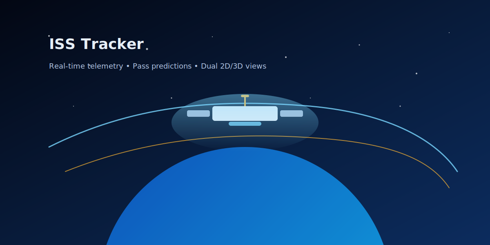

# ISS Observer — VASEY/SPACE

<p align="center">
  
</p>

[](https://github.com/SeanVasey/ISS-Observer/actions/workflows/ci.yml)
[](https://developer.mozilla.org/docs/Web/JavaScript)
[](https://vite.dev)
[](#pwa)
[](#changelog)
[](LICENSE)
[](https://nodejs.org)
[](https://celestrak.org)
[](https://globe.gl)

A real-time International Space Station tracker that combines orbital telemetry, personalized pass predictions, and synchronized 2D + 3D visualization — built as a mobile-first PWA with a monochrome space-age aesthetic.



## Features

- **Real-time ISS telemetry** — live latitude/longitude, altitude, and velocity updated every second.
- **Personalized pass predictions** — 72-hour window with rise/peak/set times, azimuths, duration, and visibility labels for any location.
- **Visibility analysis** — accounts for civil twilight at observer location and ISS sunlight illumination to determine when the station is actually visible to the naked eye.
- **Top pick recommendations** — best viewing opportunities scored by elevation (50%), duration (30%), and sky darkness (20%).
- **Countdown timer** — live countdown to the next upcoming pass.
- **Dual visualization** — synchronized 2D Leaflet ground track map and 3D Globe.gl interactive globe with day/night terminator overlay and a 3D ISS model rendered on the globe.
- **Reminders + sharing** — downloadable `.ics` calendar invites and shareable URLs with encoded pass details.
- **Installable PWA** — service worker with offline caching, web app manifest, and iOS home screen support.
- **Mobile-first design** — optimized for iOS with safe area insets, touch-friendly controls, and responsive breakpoints.
- **Monochrome aesthetic** — clean light backgrounds with dark text providing stark contrast for a space-age look.

## Tech Stack

| Layer | Technology |
|-------|-----------|
| Language | Vanilla JavaScript (ES2022 modules) |
| Bundler | [Vite](https://vite.dev) 7.x |
| 2D Maps | [Leaflet](https://leafletjs.com) + [CARTO](https://carto.com) light tiles |
| 3D Globe | [Globe.gl](https://globe.gl) + [Three.js](https://threejs.org) |
| Orbital Mechanics | [satellite.js](https://github.com/shashwatak/satellite-js) 5.x |
| Sun Position | [SunCalc](https://github.com/mourner/suncalc) |
| Analytics | [@vercel/analytics](https://vercel.com/analytics) |
| Deployment | [Vercel](https://vercel.com) |

## Getting Started

### Prerequisites

- Node.js 18+
- npm

### Install

```bash
npm install
```

### Development

```bash
npm run dev
```

Opens the Vite dev server at `http://localhost:3000`.

### Build

```bash
npm run build
```

Produces a production-ready `dist/` directory.

### Preview

```bash
npm run preview
```

Serves the built `dist/` on port 4173 for local verification.

### Lint & Test

```bash
npm run lint       # Syntax check all .js files
npm test           # Run unit tests (Node.js native test runner)
npm run test:watch # Run tests in watch mode
```

## Configuration

Edit `public/config.js` to set a contact email for the OpenStreetMap Nominatim geocoder (recommended for production to comply with their usage policy):

```js
window.VASEY_CONFIG = {
  nominatimEmail: 'your-email@example.com'
};
```

## Project Structure

```
.
├── index.html              # App shell with PWA meta tags
├── package.json            # Dependencies and scripts (v1.0.1)
├── vite.config.js          # Vite build configuration
├── vercel.json             # Vercel deployment and headers
├── CLAUDE.md               # AI assistant context
├── src/
│   ├── main.js             # App bootstrap, state, UI, visualization
│   ├── style.css           # Monochrome design system
│   └── lib/
│       ├── format.js       # Formatting helpers, scoring, brightness
│       ├── orbit.js        # TLE fetch/cache, propagation, sun position
│       └── passes.js       # 72-hour pass prediction, visibility
├── public/
│   ├── config.js           # Runtime configuration
│   ├── manifest.json       # PWA web app manifest
│   ├── sw.js               # Service worker (cache-first static, network-first API)
│   ├── favicon.svg         # Browser tab icon (square-cropped ISS)
│   └── iss-icon.svg        # ISS illustration icon
├── tests/
│   └── format.test.js      # Unit tests for format helpers
├── scripts/
│   ├── lint.mjs            # Syntax linter
│   ├── build.mjs           # Legacy build script
│   └── serve.mjs           # Legacy dev server
├── docs/
│   └── assets/             # Promotional artwork
└── .github/
    └── workflows/
        └── ci.yml          # CI pipeline (lint → test → build)
```

## PWA

ISS Observer is installable as a Progressive Web App:

- **Service worker** caches static assets (cache-first) and API responses (network-first with fallback).
- **Web app manifest** enables Add to Home Screen on iOS and Android.
- **Offline support** — previously loaded data remains accessible without a network connection.

## How It Works

1. **TLE data** is fetched from [Celestrak](https://celestrak.org) and cached locally for 12 hours.
2. **Orbital propagation** uses the SGP4 algorithm via satellite.js to compute the ISS position at any given time.
3. **Pass prediction** iterates through a 72-hour window at 20-second steps, detecting when the ISS rises above the observer's horizon.
4. **Visibility determination** checks two conditions simultaneously: the observer must be in civil twilight (sun below -6°) and the ISS must be sunlit (not in Earth's shadow).
5. **Sun position** is calculated using simplified astronomical algorithms for ECI coordinates, with a cylindrical Earth shadow model for sunlight detection.
6. All times are displayed in the browser's local timezone via the `Intl.DateTimeFormat` API.

## Deployment

### Vercel (recommended)

The repository includes `vercel.json` with:
- Build command: `npm run build`
- Output directory: `dist/`
- Security headers (X-Content-Type-Options, X-Frame-Options, X-XSS-Protection)
- Immutable caching for hashed assets
- SPA rewrites with PWA asset exclusions

### Other providers

Run `npm run build` and deploy the `dist/` directory to any static hosting provider (Netlify, GitHub Pages, S3, Cloudflare Pages).

## Changelog

See [CHANGELOG.md](CHANGELOG.md) for version history.

## License

MIT — see [LICENSE](LICENSE).

See [ASSETS_LICENSE.md](ASSETS_LICENSE.md) for third-party asset attribution.
