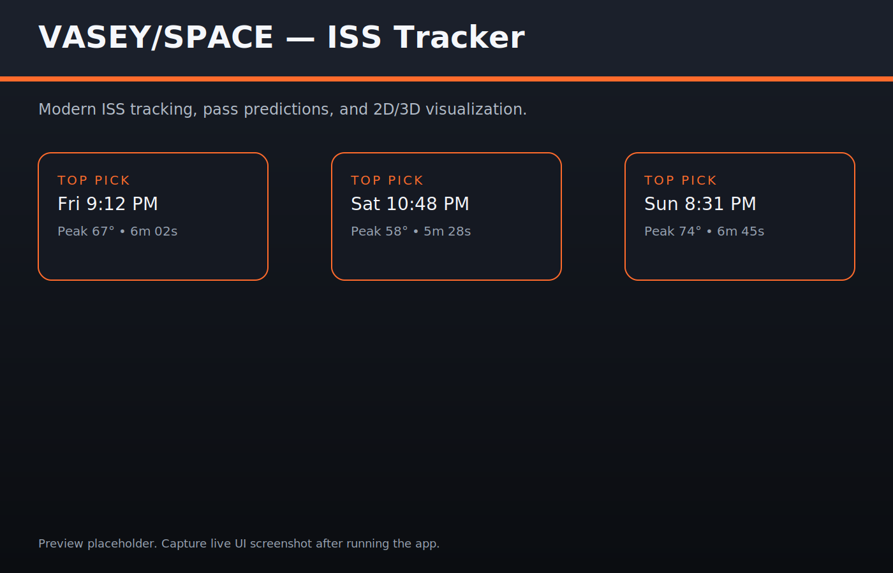

# VASEY/SPACE — ISS Tracker

[](https://developer.mozilla.org/docs/Web/JavaScript)
[](https://developer.mozilla.org/docs/Web/HTML)
[](https://developer.mozilla.org/docs/Web/CSS)
[](.github/workflows/ci.yml)
[](#)
[](LICENSE)

A modernized ISS tracking and sighting predictor experience that blends real-time orbital telemetry, viewing predictions, and synchronized 2D + 3D visualization.




## Features

- **Real-time ISS telemetry** with live latitude/longitude, altitude, and velocity.
- **Personalized pass predictions** including rise/peak/set times, azimuths, duration, and visibility labels.
- **Top pick recommendations** scored by elevation, duration, and darkness.
- **Dual visualization** with a 2D ground track map, 3D globe, and day/night terminator overlay.
- **Reminders + sharing** via downloadable calendar invites and shareable URLs.
- **Responsive VASEY/SPACE styling** with accessible, mobile-friendly layouts.

## Tech Stack

- **Vanilla JavaScript (ES modules)**
- **Leaflet** (CDN) for 2D mapping
- **Globe.gl + Three.js** (CDN) for 3D visualization
- **satellite.js + SunCalc** (CDN) for orbital propagation and sun position
- **Node.js scripts** for local dev, linting, tests, and build packaging

## Getting Started

### Prerequisites

- Node.js 18+
- npm

### Install

No package installation is required. The app loads third-party libraries from a CDN and uses lightweight Node.js scripts for dev/build/test.

### Run (development)

```bash
npm run dev
```

### Build

```bash
npm run build
```

### Test

```bash
npm run lint
npm run test
```

## Environment Variables

Edit `public/config.js` to add a contact email for the OpenStreetMap Nominatim geocoder:

```js
window.VASEY_CONFIG = {
  nominatimEmail: 'your-email@example.com'
};
```

## Project Structure

```
.
├── index.html
├── src/
│   ├── main.js
│   ├── style.css
│   └── lib/
│       ├── format.js
│       ├── orbit.js
│       └── passes.js
├── tests/
├── docs/
│   └── MANIFEST.md
├── public/
│   └── config.js
├── scripts/
│   ├── build.mjs
│   ├── lint.mjs
│   └── serve.mjs
└── .github/workflows/ci.yml
```

## Usage Notes

- The ISS position is computed from live TLE data provided by Celestrak. Data is cached locally for 12 hours.
- Pass visibility uses a combination of sun elevation (civil twilight) and ISS sunlight checks.
- All times are shown in the browser's local timezone.

## Deployment

Run `npm run build` to produce a static `dist/` directory. Deploy the contents to any static hosting provider (Netlify, Vercel, GitHub Pages, S3).

## License

MIT

See [ASSETS_LICENSE.md](ASSETS_LICENSE.md) for third-party asset attribution.
